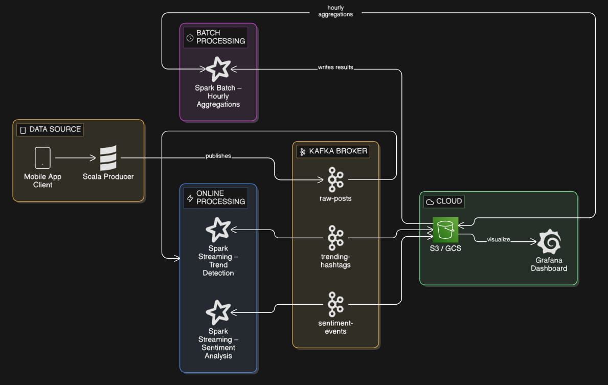

# Social Media Pipeline

Pipeline de Big Data sencillo para procesar tweets simulados en tiempo real.

## Arquitectura



Flujo general:

1. El producer genera posts simulados y los publica en Kafka en el topic raw-posts.
2. TrendDetection, SentimentAnalysis y AlertDetection consumen raw-posts y publican resultados en topics derivados.
3. BatchAggregations lee datos históricos desde Kafka y guarda reportes en Parquet.
4. Grafana consume o visualiza los resultados ya agregados.

## Componentes

| Componente            | Descripción                                                                       |
| --------------------- | --------------------------------------------------------------------------------- |
| **Producer**          | Genera tweets simulados (5% con contenido sensible) y los envía a Kafka           |
| **TrendDetection**    | Cuenta hashtags en ventanas de 30s y publica hashtags con suficiente volumen      |
| **SentimentAnalysis** | Clasifica tweets como positivo/negativo/neutro con palabras clave                 |
| **AlertDetection**    | Detecta contenido sensible y publica alertas en Kafka; además puede enviar correo |
| **BatchAggregations** | Lee datos históricos de Kafka y genera reportes en Parquet                        |
| **Grafana**           | Dashboard de visualización en tiempo real                                         |

## Requisitos

- Docker y Docker Compose
- (Opcional) Cuenta Gmail con [contraseña de aplicación](https://myaccount.google.com/apppasswords) para alertas

## Cómo ejecutar

### 1. Configurar variables de entorno

```bash
cp .env.example .env
# Edita .env con tus credenciales de Gmail
```

### 2. Levantar todo

```bash
docker-compose up --build
```

Deja este comando corriendo en una terminal. En otra terminal ejecuta las verificaciones o comandos de lectura de topics.

### 3. Acceder a Grafana

Abre [http://localhost:3000](http://localhost:3000)

- Usuario: `admin`
- Contraseña: `admin`

### 4. Ver logs

```bash
# Producer (tweets generados)
docker logs -f scala-producer

# Streaming (tendencias, sentimiento, alertas)
docker logs -f spark-streaming

# Batch (agregaciones)
docker logs -f spark-batch
```

### 5. Verificar topics de Kafka

Si el pipeline está funcionando, estos comandos deben mostrar mensajes reales:

```bash
docker run --rm --network social-media-pipeline_default confluentinc/cp-kafka:7.4.0 kafka-console-consumer --bootstrap-server kafka:29092 --topic raw-posts --from-beginning --timeout-ms 5000 --max-messages 5

docker run --rm --network social-media-pipeline_default confluentinc/cp-kafka:7.4.0 kafka-console-consumer --bootstrap-server kafka:29092 --topic sentiment-events --from-beginning --timeout-ms 5000 --max-messages 5

docker run --rm --network social-media-pipeline_default confluentinc/cp-kafka:7.4.0 kafka-console-consumer --bootstrap-server kafka:29092 --topic alert-events --from-beginning --timeout-ms 5000 --max-messages 5

docker run --rm --network social-media-pipeline_default confluentinc/cp-kafka:7.4.0 kafka-console-consumer --bootstrap-server kafka:29092 --topic trending-hashtags --from-beginning --timeout-ms 5000 --max-messages 5
```

Qué esperar:

- raw-posts debe mostrar posts simulados generados por el producer.
- sentiment-events debe mostrar el sentimiento calculado por SentimentAnalysis.
- alert-events debe mostrar posts marcados como sensibles por AlertDetection.
- trending-hashtags debe mostrar hashtags con suficiente volumen dentro de la ventana de tiempo.

## Topics de Kafka

| Topic               | Descripción                            |
| ------------------- | -------------------------------------- |
| `raw-posts`         | Tweets crudos del producer             |
| `trending-hashtags` | Hashtags con más menciones por ventana |
| `sentiment-events`  | Clasificación de sentimiento por tweet |
| `alert-events`      | Posts con contenido sensible detectado |

## Tecnologías

- **Scala 2.12** — Lenguaje de programación funcional
- **Apache Kafka** — Message broker para streaming
- **Apache Spark 3.5.8** — Motor de procesamiento distribuido
- **Grafana** — Visualización de datos
- **Docker** — Contenedorización
